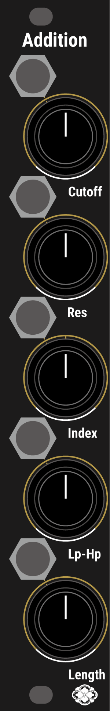

# Addition
Addition is an expander for Helical.

The following features are added:

1. Individual SVF Filters added to all 16 oscillators.
2. Adjustment of the length of the volume envelope.

)

# Controls and Outputs

    

### Cutoff
* Adjusts the Cutoff Frequency of the SVF Filter.

  The Cutoff Frequency is key-tracked, aligning with the oscillator's frequency at the 10 o'clock position.

### Q 
* Adjusts the Q of the SVF Filter.

### Index
* Adjusts the amount of modulation of the cutoff frequency on its own volume envelope.

  At 12 o'clock there is no modulation, counterclockwise for negative direction modulation, and clockwise for positive direction.
### LP-HP
* Adjusts the balance of the output mix of Lowpass, Bandpass, and Highpass of the SVF Filter.

  Counterclockwise for LP, at 12 o'clock for BandPass, and clockwise for HP.

### Length
* Adjusts the length of the volume envelope.

  The length set by this knob does not affect the length of the sound determined by Autoregressive Synthesis. Clockwise for the original length of sound, counterclockwise for very short, pulse-like sounds. This knob allows for the insertion of silence, which was not possible with Helical. 
  
# Connection
Use the included Expander Cable to connect the 12-pin terminal on Helical to the 10-pin terminal on Addition.

<b>Addition does not require power. Always use the cable provided with Addition (connection with power cables is not possible). Damage due to connecting with power cables or similar is not covered under warranty.</b>

# Update firmware

Compatible with v1.21 and later. If your Helical's serial number is 120 or later, no update is necessary.

It will operate with v1.1, but we strongly recommend updating due to updates related to the filter's operation.

Please download the firmware (bin file) from Helical's GitHub page.

Go to the <a href = "https://electro-smith.github.io/Programmer/">Daisy Web Programmer</a> page, follow the instructions to upload the firmware.

After unplugging the USB cable from DaisySeed, turn on the power of the Eurorack case and check if the firmware update has been done correctly.

# Specification
Width : 4HP  
Max Depth: 30mm  
Maximum current draw:
* 0mA @12V
* 0mA @-12V

CV input range: +/- 5V (depends on the knob position)

# Contact
Please contact support at the following address. Replace "a" with "@" in the address.

sdkc.store[a]gmail.com