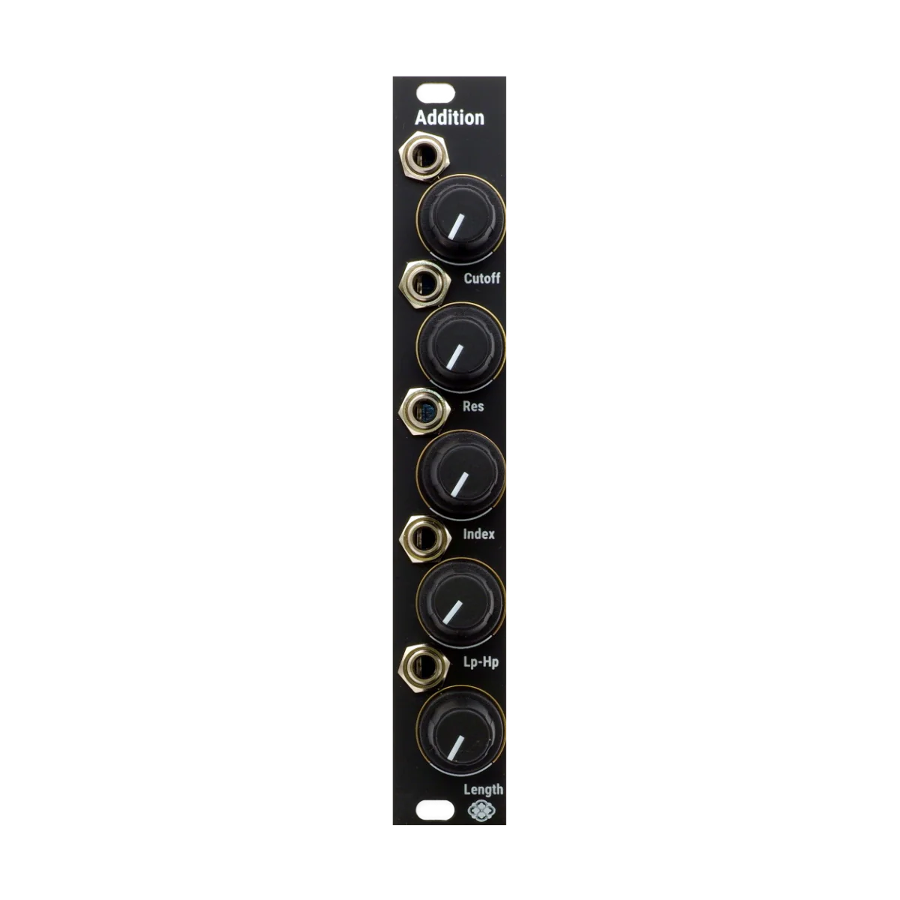

# Addition
AdditionはHelicalを拡張するエクスパンダーです。

以下の機能が追加されます。

1. 16個全てのオシレーターへ個別のSVF Filterの追加。
2. 音量のエンベロープの長さの調整。

)

# Controls and Outputs

    

### Cutoff
* SVF FilterのCutoff Frequencyを調整します。
  
  Cutoff FrequencyはKeyTrackingされており、つまみが10時の時に、自身のオシレーターの周波数と一致します。

### Q 
* SVF FilterのQを調整します。

### Index
* 自身の音量のエンベロープをCutoff Frequencyでモジュレーションする量を調整します。
  
  つまみの位置が12時で、モジュレーション無し、CCWで負の方向へのモジュレーション、CWで正の方向へモジュレーションがかかります。

### LP-HP
* SVF FilterのLowpass,Bandpass,Highpassの出力ミックスのバランスを調整します。
  CCWでLP、12時でBandPass、CWでHPとなります。

### Length
* 音量エンベロープの長さを調整します。
  
  このつまみで設定された音の長さは、AutoregressiveSynthesisで決定された音の長さには影響を与えず、CWで元々の音の長さ、CCWで非常に短いパルスの様な音になります。元々の音の長さに影響は与えないので、Helicalには存在しなかった無音を挿入することが可能になります。
  
# Connection
付属のExpanderCableを使用し、Helicalに12pin端子、Addition側に10pinの端子を接続してください。

<b>Additionは電源を必要としません。必ずAddition付属のケーブル(電源ケーブルでの接続はできません)を必ず使用してください。電源ケーブルなどを繋いで接続した場合の故障は保証対象外になります。</b>

# Update firmware

v1.21以降対応しています。Helicalのシリアルが120番以降であればアップデートの必要はありません。

v1.1でも動作いたしますが、フィルターの動作に関するアップデートが含まれている為、アップデートを強くお勧め致します。

HelicalのGitHubのページからファームウェア（binファイル）をダウンロードしてください。  
<a href = "https://electro-smith.github.io/Programmer/">Daisy Web Programmer</a> のページに移動し、記載されている手順に従ってファームウェアをアップロードしてください。  
DaisySeedからUSBケーブルを抜いた後、ユーロラックケースの電源を入れて、ファームウェアのアップデートが正常に行われているか確認してください。 

# Specification
Width : 4HP  
Max Depth: 30mm  
Maximum current draw:
* 0mA @12V
* 0mA @-12V

CV input range: +/- 5V (depends on the knob position)

# Warranty

Sdkc Instrumentsは、本製品の購入日から1年間、材料および製造上の欠陥がないことを保証します（購入証明書や領収書が必要です）。

不適切な電源電圧、Eurorackバスボードケーブルの逆接続、製品の誤使用、ノブの取り外し、フェイスプレートの交換、非公式のファームウェア更新を含む許可されていない改造、その他Sdkc Instrumentsがユーザーの責任と判断した原因による不具合は保証対象外となり、その場合は通常の修理料金が適用されます。

また、過度な高温や湿気などの極端な環境条件による損傷も保証対象外となります。

保証サービスが必要な場合は、購入された販売店にお問い合わせください。保証対象となる不具合が確認された場合、Sdkc Instrumentsは製品の修理または交換を行います。

本製品の使用や誤使用によって生じた人身事故や物的損害について、Sdkc Instrumentsは一切の責任を負いません。ご不明点がある場合は、sdkc.store[a]gmail.com またはお近くの販売店までお問い合わせください。

# Contact
下記のアドレスにご連絡ください。[a]を@に置き換えてください。

sdkc.store[a]gmail.com