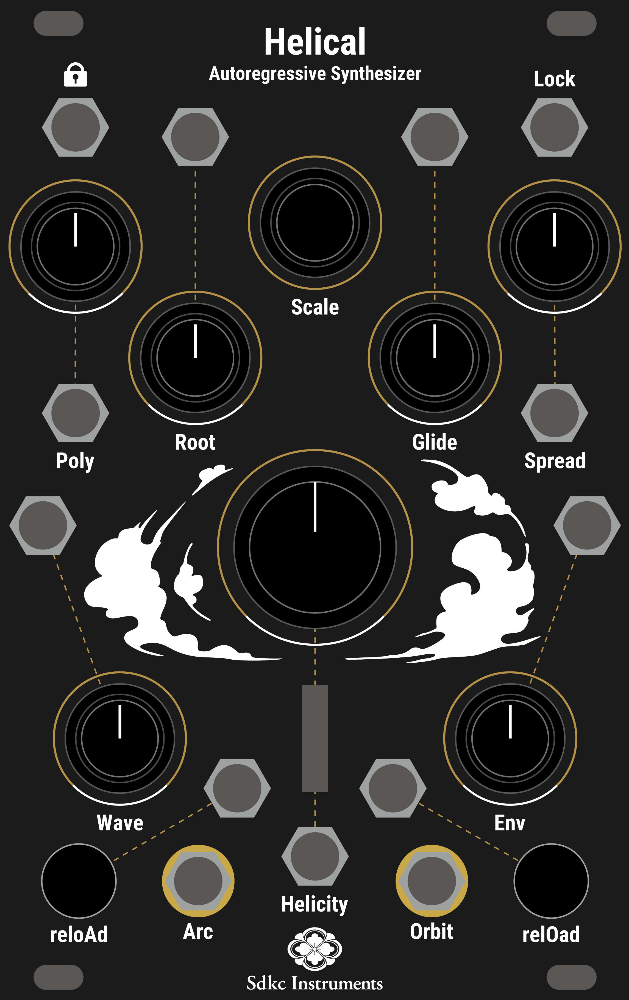

# Helical

Helical is a 16-voice polyphonic Autoregressive Algorithmic Synthesizer.  
With Autoregressive Synthesis/Sequence, it continuously generates new phrases.  
Each of the 16 voices consists of a sequencer, wavetable oscillator, envelope generator, and VCA.  
Users can change the scale and LED color with a dedicated editor, and wavetables can be modified using Synthesis Technology's WaveEdit.  

    

# Autoregressive Synthesis/Sequence
Autoregressive Synthesis/Sequence is an original method that refers to its past parameters to determine the next parameters.  
In Helical, the past pitch of each oscillator affects the next duration, and the past duration affects the next pitch. By connecting to the past in a helical relationship, the sound is not completely random, but rather generates an organic sound.  

  

New pitch and duration calculations when the envelope reaches its end.

The progression of autoregression generates the envelope and pitch flow shown in the figure above.

Helical is designed to generate new rhythms beyond existing music theory by calculating duration independent of tempo and BPM. (It is possible to synchronize to an external clock by using the Poly function.)

# Diagrams
  

# Controls

    

### Poly
* Set the polyphony of each Arc/Orbit output from 0 to 8.  
Lowering the Poly setting rapidly does not immediately silence the sound; the unit processing stops when each unit's envelope reaches end. When raising the Poly, the envelope starts when the unit turns on.  
By utilizing this feature, you can achieve synchronization with an external clock by setting the Poly knob to 0 and connecting a Clock or Gate to the CV in. In this case, the Helicity knob functions like a Clock Divider.   
Sending very short Clock/Gate signals will make it easier to understand the synchronization with the external source. Additionally, passing the Clock/Gate signal through an attenuverter first allows you to control the number of notes played.

### Root
* Set the root note. V/OCT tracking may become unstable outside the 1-5V range.
### Scale
* Sets the scale to be used. You can change the wavetable preset by turning the knob while pressing the encoder in.

### Glide
* Set the transition time when changing to the next pitch. Applies to all pitch changes, including changes in Scale and Root.

### Spread
* Set the width of change when converting from duration to pitch. With CCW, the pitch becomes only Root, and with CW, it changes from the frequency of Root to G9 (12543.9Hz).

### Wave
* Morphing Wavetables within a preset. Interpolation between wavetables is performed, allowing smooth transitions between tables.

### Helicity
* Determines the multiplier when converting from pitch to duration.  
The duration is determined by (√pitch) * Helical, with a change range of 0.002-300 times.

### Env
* Sets the ratio of attack and decay for the envelope.  
At both edges of the knob, the curve changes from linear to log curve.  
Envelope changes are not applied until the envelope reaches its end.

### reloAd / relOad
* Forcibly recalculates the parameters for each Unit in the Arc and Orbit channels.  
Regardless of the number of polyphonies, the duration and pitch of all units are recalculated.  
Patching 5V Gate enables external control.

### Lock
* Even when the envelope reaches end, the duration and pitch are not recalculated, and the current state is looped.   
Patching the 5V Gate will lock when the Gate is HIGH.

# Function
### Volume Edit
* By pressing and holding the Scale knob and the left reload button, then turning the Scale knob, you can adjust the default volume.   
This change is saved to the SD card and will persist after the device is restarted.

### Fine Tuning
* By pressing and holding the Scale knob and the right reload button, then turning the Scale knob, you can adjust the fine tuning.   
This change is saved to the SD card and will persist after the device is restarted.

### LED Brightness
* By pressing and holding the Scale knob and the right and light reload button, then turning the Scale knob, you can adjust the LED Brightness.   
This change is saved to the SD card and will persist after the device is restarted.  
If your case doesn't provide enough power, you can reduce power consumption by adjusting the LED brightness.

# Wavetable Edit
Synthesis Technology's <a href="https://synthtech.com/waveedit/">Wave Edit</a> can be used to create original presets of wavetables.  
Rename the exported wav file to buf_wt.wav and write it to the SD card.

  

As described above, each of the 8 tables is processed as a single preset on Helical.  

For more information on how to use Wave Edit, please refer to the  <a href="https://synthtech.com/waveedit/">SynthsisTechnology page</a>.  

If you are using other software, please create a wav file with a table size of 256sample, 64 types, total 16384samle, and rename it buf_wt.wav and write it to the SD card.  
48kHz/24bit is recommended.

# Scale Edit
Please refer to the <a href = "https://github.com/SdkcInstruments/Helical/tree/main/ScaleEditor">ScaleEditor</a> page.

# Update firmware
Helical does not support anything other than the official firmware.  
Any malfunctions that occur as a result of writing unofficial firmware will not be covered by the warranty.

Please download the firmware (bin file) from Helical's GitHub page.  
Go to the <a href = "https://electro-smith.github.io/Programmer/">Daisy Web Programmer</a> page and follow the instructions provided to upload the firmware.  
After unplugging the USB cable from DaisySeed, turn on the power to the Eurorack case and check to see if the firmware update has been carried out correctly.  
For Helical units with a serial number on the back from 6 to 55, the shipping firmware version is v1.11.

# Specification
Width : 16HP  
Max Depth: 40mm  
Maximum current draw:
* 240mA @12V
* 12mA @-12V
  
Audio codec: 48kHz/24bit  
Control rate: audio-rate for the Helicity knob, 1kHz for the another CV inputs.  
CV input range: +/- 5V (depends on the knob position)

# Roadmap
* Development of an Expander that allows to control SVF filters. (Almost completed)
* Support for 8+ wavetable presets from multiple wav files.
* Support for 10+ scale presets.
* Support for Micro Tuning.

# Acknowledgment
Without the help of the following people, Helical would not have been completed.  
I offer my heartfelt thanks
* <a href = "https://hananosuke.jp/">Hananosuke Takimoto</a>
* Tanipoyo
* <a href = "https://www.bofo.jp/">Yoshimi Tajima(Cloud Design on the panel)</a>