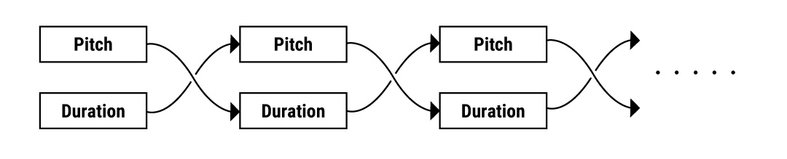
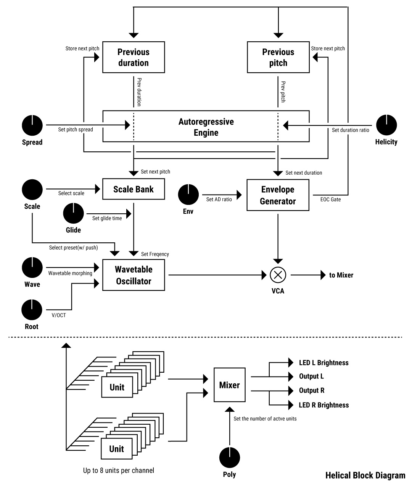

# Helical Firmware Manual v2.08


This version introduces MIDI features for the "Cuh" MIDI expander, along with new features such as dynamics settings and calibration.  
Refer to the [ChangeLog](#changelog-v208) and see the [Update firmware](#update-firmware) section at the bottom of this page for instructions.

---

# Helical Overview

**Helical** is a 16-voice polyphonic synthesizer based on **Autoregressive Algorithmic Synthesis**.  
It continuously generates new phrases and sonic patterns using an autoregressive model.

Each oscillator is equipped with its own sequencer, wavetable oscillator, envelope generator, and VCA.  
Users can customize scales, LED colors, and wavetables using an SD card and dedicated editors.


[Watch the demo on YouTube](https://www.youtube.com/watch?v=5pqRVQMexkI)

---

# Autoregressive Synthesis / Sequencing

This synthesis method uses past values to determine the next parameters.  
In Helical, each oscillator’s previous pitch determines the next duration, and the previous duration influences the next pitch.  
This helical influence from past to future creates natural-sounding sequences rather than random ones.




New pitch and duration are calculated when the oscillator's envelope finishes.  


Unlike conventional rhythm concepts based on BPM, Helical explores new rhythmic expressions.  
(You can sync with external clocks by sending them to the CV input of the **Poly** knob.)

---

# System Diagram



---

# Controls and Outputs


### Arc / Orbit Outputs

Helical splits its output into Arc and Orbit for every 8 voices.

- If Orbit is unpatched, Arc outputs all voices in Mono mode.

### Poly
Sets the number of active voices (0–8 for polyphonic, 0–16 in Mono mode).

- Voices keep playing until their envelopes finish, even if the Poly knob is turned to CCW (min).
- Oscillators are inactive by default. Increasing the Poly value brings them into an active state.
- If Poly is set to 0 and an external clock is connected to its CV input, Helical syncs to it.  
  In this mode, the **Helicity** knob acts as a clock divider.

### Root
Sets the root note.

- Outside the 1–5V range, 1V/Oct tracking may become unstable.
- In **Chromatic Mode**, root changes take effect after the current note finishes.

### Scale / Wavetable

- Turn the knob to change scale.
- Press + turn to change wavetable.
- If **Lock** is ON (switch up), the scale changes instantly.
- If OFF (switch down), changes apply after the note ends.

**Default scale presets:**
```
0: Major(R)
1: Lydian(R)
2: Mixolydian(R)
3: Major Pentatonic(R)
4: Natural Minor(R)
5: Dorian(R)
6: Phrygian(R)
7: Minor Pentatonic(R)
8: I M7(R)
9: II m7(R)
10: III m7(R)
11: IV M7(R)
12: V 7(R)
13: VI m7(R)
14: Whole tone
15: Chromatic
```
(R) = Root Emphasize enabled

When Root Emphasize is on, the lowest octave uses only root-related notes. Higher octaves follow the full scale.

### Glide
Sets portamento between notes.

- When Helicity is high: glide time = 0–1s
- When Helicity is low: glide time depends on the current note length

Applies to pitch changes like Scale/Root/Reload.

### Spread
Sets pitch range when calculating from duration.

- CCW: Only root note
- CW: Range up to G9

### Wave
Smoothly morphs between wavetable frames in a preset.

### Helicity
Sets the scaling factor for converting pitch into duration.

```
Duration = sqrt(Pitch) * Helicity
Range: 0.002x to 300x
```

### Env
Sets attack/decay ratio of the envelope.

- Settings apply per-note when a new envelope triggers.
- Allows varied textures like fast attack, slow fade, reversed envelopes.
- At 20–35% and 85–100% of knob position, curve changes to logarithmic.


### reloAd / reloOd
Manually re-calculate parameters for oscillator units.

- If **reloOd** input is unpatched, triggers on **reloAd** apply to all oscillators.

### Lock
Disables pitch/duration calculation when envelopes complete.

---

# Wavetable Editing

Use [Wave Edit](https://synthtech.com/waveedit/) to create custom wavetable presets.


- Each group of 8 wavetables = 1 Helical preset
- Rename your `.wav` file to `buf_wt.wav` and place it on the SD card

**Requirements for custom wave files:**
- 256 samples per table
- 64 tables
- Total: 16384 samples

---

# Scale Editing
Use the [Scale Editor](https://github.com/SdkcInstruments/Helical/tree/main/ScaleEditor) on GitHub.

---

# MIDI Output

By connecting the USB Micro-B port to **Cuh (MIDI Expander)**, Helical acts as a USB MIDI device and sends:
- Note messages
- CC messages for all knobs and Lock switch

⚠️ **Do not connect Helical directly to MIDI gear without using Cuh.** This may cause overcurrent and void the warranty.  
Cuh blocks power from USB Hosts for safety.

Helical/Cuh act as MIDI **Devices** only. To use with MIDI Hosts, an external converter is required.

---

# Calibration Mode

To calibrate all knobs and CV inputs:
1. Turn off power and disconnect all patch cables.
2. Hold **reloAd** and **relOad** buttons while powering on. Release when left LED turns red.
3. Turn all knobs fully CCW.
4. Press and release **reloAd** (bottom-left button).
5. When right LED turns red, turn all knobs fully CW.
6. Press and release **relOad** (bottom-right button).

If calibration succeeds, Helical boots normally. Otherwise, retry from step 1.

**For accurate V/OCT calibration:**
- Send 0V to RootIn during step 3, and 5V during step 5.

---

# Hidden Settings

## Dynamics Setting
Assigns random volume per note within a defined range.

### How to enter:
1. Double-click the **Scale knob** to enter Dynamic Setting Mode (LED blinks fast).
2. Hold **reloAd** + turn Scale knob = set volume center.
3. Hold **relOad** + turn Scale knob = set volume width.
4. Click Scale knob to exit.

You can also edit `volCenter` and `volWidth` (0–100%) in `setting.txt` on the SD card.

MIDI velocities are mapped from the internal volume range to 0–127.

## Chromatic Mode
Hold **Scale knob** while powering on to toggle.  
On = pitch steps in semitones.  
Off = pitch changes linearly with Root knob.

You can also set this in `setting.txt`:
```
chromaticMode 1   # on
chromaticMode 0   # off
```

## Volume Edit
Hold **reloAd** + press and turn Scale knob = set master volume.

## Fine Tune
Hold **relOad** + press and turn Scale knob = set fine tuning.

---

# SD Card Edits

## setting.txt
Most parameters can be set from the panel, but fine-tuning is possible by editing `setting.txt`.

If something breaks after editing, restore the `factoryPreset` file.

| Setting         | Description            | Range             |
|-----------------|------------------------|-------------------|
| finetune        | Fine tuning            | -32767 ~ 32767    |
| scale           | Default scale index    | 0 ~ 9             |
| wavetable       | Default wavetable      | 0 ~ 9             |
| volCenter       | Dynamics center        | 0 ~ 100 (%)       |
| volWidth        | Dynamics width         | 0 ~ 100 (%)       |
| chromaticMode   | Chromatic Mode toggle  | 0 (off) / 1 (on)  |
| masterVol       | Master volume          | 0 ~ 65535         |
| envMode         | Envelope behavior      | 0 (old) / 1 (new) |

### Sample:
```txt
finetune 0
scale 8
wavetable 0
volCenter 46
volWidth 35
chromaticMode 1
masterVol 43007
envMode 1
```

## calibration.txt
Contains raw calibration values for knobs. Usually doesn't need to be edited manually.

If needed, the format is:
```txt
poly_min root_min glide_min ... length_min poly_max root_max ... length_max
```

Each value = 0 ~ 65536.  
Note: `min > max` is the correct form (they are inverted internally).

---

# Update Firmware

Only official Helical firmware is supported.  
Writing custom Daisy firmware may damage the unit and void the warranty.

To update:
1. Download the `.bin` firmware file from [Helical GitHub](https://github.com/SdkcInstruments/Helical/blob/main/beta/helical_firmware_v2.01.bin).
   - **Don't use right-click > Save As**. Use "Download Raw File" instead.
2. Visit [Daisy Web Programmer](https://electro-smith.github.io/Programmer/) and follow the instructions.
3. If the write is successful, you'll see: `Wrote 129828 bytes`
4. Disconnect USB and power the Eurorack case to boot.

---

# Troubleshooting

- **LED flashing red/green/blue:**
  - SD card not detected. Check insertion.
  - Try replacing contents with factory preset files.

- **LED flashing red/white/yellow:** (Not implemented)
  - Wavetable load failure. Ensure file is named `buf_wt.wav` and has valid format.

- **Not booting after firmware update:**
  - Reflash the firmware.

- **Other issues:**
  - Daisy may be inserted backward. Contact your dealer or us.

---

# Specifications

- Width: 16HP
- Max Depth: 40mm
- Power: 240mA @+12V, 12mA @-12V
- Audio Codec: 48kHz / 24bit
- Control Rate:
  - Helicity CV: audio-rate
  - Others: 1kHz
- CV Input Range: ± 5V (range affected by knob position)

---

# Changelog (v2.08)

1. Added MIDI Output and CV modulation support via **Cuh** Expander. [See MIDI](#midi-output)
2. Modified envelope behavior. [See Env](#env)
3. Added **Dynamics Setting**. [See Dynamics](#dynamics-setting)
4. Expanded max scales to 16. Improved live scale switching. [See Scale](#scale--wavetable)
5. Added **Calibration Mode**. [See Calibration](#calibration-mode)
6. Changed **Glide** behavior. [See Glide](#glide)
7. Improved SD card error handling. [See Troubleshooting](#troubleshooting)
8. Removed brightness setting.
9. Various minor fixes.

---

# Acknowledgments

Helical would not exist without the support of the following individuals:

- [Hananosuke Takimoto](https://hananosuke.jp/)
- Tanipoyo
- [Yoshimi Tajima](https://www.bofo.jp/) (Panel design)

---

# Warranty

Sdkc Instruments warrants this product to be free of defects in materials and manufacturing for **1 year from date of purchase** (proof required).

The warranty does not cover:
- Incorrect power supply voltages
- Reversed Eurorack bus connection
- Misuse or abuse
- Knob or faceplate removal
- Unauthorized firmware modifications
- Environmental damage (e.g., heat, humidity)

If warranty service is needed, contact your dealer. If covered, Sdkc Instruments will repair or replace the product.

Sdkc Instruments is not liable for any injury or damage resulting from use or misuse of the product.

---

# Contact
For inquiries, please email:  
**sdkc.store[a]gmail.com** (replace `[a]` with `@`)

