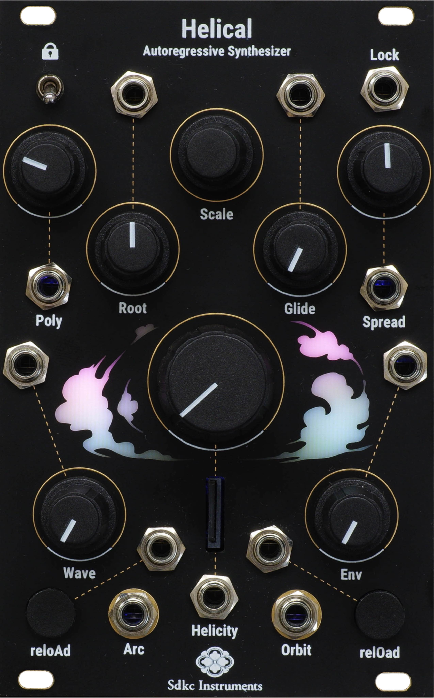

# Manual v2.08 
本バージョンでは、「Cuh」を使用するためのMIDI機能が追加されました。  
その他、ダイナミクスの設定/キャリブレーションなど様々な機能が追加されています。  
[ChangeLog](#changelogv208)  
アップデートの方法については本ページ末尾の[『Update firmware』](#update-firmware)セクションを参照してください。


# Helical
Helicalは自己回帰型シンセシス(Autoregressive Algorithmic Synthesizer)により構成された16音ポリフォニックシンセサイザーです。  
自己回帰型シンセシスにより、無限に新しいフレーズや音響を生み出し続けます。  
各オシレーターは、シーケンサー、Wavetableオシレーター、エンベロープジェネレーター、VCAを備えており、独立して動作します。
ユーザーはパネル前面のSDカードに書き込むことで、スケール、LEDの色を専用のエディターで変更する事ができ、Wavetableも自由に変更可能です。


<div style="text-align: center">
    
</div>

[](https://www.youtube.com/watch?v=5pqRVQMexkI)

# Autoregressive Synthesis/Sequence
自己回帰型シンセシスはオリジナルの手法で、次のパラメーターを決定する為に、過去の状態を参照するアルゴリズムを持っています。
Helicalでは、それぞれのオシレーターの過去のピッチ(音高)が次の音の長さ(音価)を決定し、過去の音価が次の音高に影響を与えています。過去から螺旋状(helical)に影響を受けることにより、完全なランダムとは異なる、自然な音響を生成します。

  


新しい音高と音価はそれぞれのオシレーターのエンベロープが最後まで到達したタイミングで決定されます。


音価と音高の計算の流れは、上図のようになります。

Helicalは既存の音楽のリズムの概念(BPMから音価を決定する)ではない、新しいリズムを探求することを目的に設計されています。  
(後述のPolyノブのCVに外部クロックを接続することにより、外部クロックとの同期もできます。)

# Diagrams
    


# Controls and Outputs

<div style="text-align: center">
    
</div>

### Arc/Orbit Outputs
Helicalの出力は8ボイス毎にArcアウトプットとOrbitアウトプットにルーティングされています。
<pre>
Orbitアウトに何も接続されていない場合はMonoモードとなり、Arcアウトプットから全てのボイスの音が出力されます。
</pre>
### Poly 
  同時発音数を0から8 (monoモードの場合は0から16) で設定します。  

<pre>
ノブの位置がCCW(最も左)にしても、それぞれのオシレーターのエンベロープが終わりに到達するまで発音は続きます。
</pre>
<pre>
全てのオシレーターユニットは無音状態では完全に止まっており、Polyノブを上げていくことで、それぞれのオシレーターは待機状態から動作を始めます。つまり、待機状態ではエンベロープのループは停止しており、動作状態になることで初めてエンベロープが開始します。  
この特性を利用して、Polyノブを0にし、CV入力にClockを接続する事で、外部のクロックと同期が可能になります。この場合HelicityノブはClockDividerの様な機能を持ちます。
</pre>

### Root
  ルート音を設定します。

    1-5vのレンジ外ではV/OCTのトラッキングが不安定になる場合があります。Chromatic Modeがオンの場合、Rootの変更は、現在の発音が終了したあとに反映されます
### Scale
使用するスケールとWavetableを設定します。Scaleはノブを回して変更し、Wavetableはノブを押し込みながら回して変更できます。
<pre>
Lockがオン（スイッチが上向き）の場合、Scaleの変更は即座に反映されますがLockがオフ(スイッチが下向き)の場合は発音が終わり次第、現在のScaleが反映された音高になります。
</pre> 


デフォルトのスケールプリセットは以下のとおりです。
<pre>
0,Major(R)  
1,Lydian(R)  
2,Mixolydian(R)  
3,Major Pentatonic(R)  
4,Natural Minor(R)  
5,Dorian(R)  
6,Phrygian(R)  
7,Minor Pentatonic(R)  
8,ⅠM7(R)  
9,Ⅱm7(R)  
10,Ⅲm7(R)
11,ⅣM7(R)
12,Ⅴ7(R)
13,Ⅵm7(R)
14,Wholetone
15,Choromatic
(R) Root Emphasizeがオンになっています。
</pre>
<pre>
Root Emphasizeがオンの場合、最も低いオクターブでは、Scaleで設定した一番下のオクターブ内の音のみが選択され、それより上のオクターブでは通常のスケールが適用されます。
より詳細はScale Editorを参考にしてください。
</pre>

### Glide
それぞれのオシレーターユニットが、次の音高に変更される際のポルタメントを設定します。  
<pre>
ポルタメントの長さは、  
・Helicityが高速の場合:0-1sの範囲で決定され、
・Helicityが低速の場合:現在発音している音の長さを基準に決定されます。
これらの設定はScaleやRootの変更、reloadボタンなど全てのピッチの変更に適用されます。
</pre>
### Spread
音価から音高を計算する際の音高の幅を設定します。
<pre>
CCWでは、Rootで設定された音のみが使用されます。
CWでRootからG9までの幅が適用されます。
</pre>
### Wave
プリセット内のWavetableを滑らかに変化させることができます。

### Helicity
音高から音価を計算する際の倍率を決定します。
<pre>
音価は √音高*Helicity の計算で決定され、Helicityの値は0.002から300倍の値をとります。
</pre>
### Env
エンベロープのアタックとディケイの割合を設定します。
<pre>
エンベロープの変更はそれぞれのエンベロープが発音する際に適用されます。
これを利用して、非常に早いアタックの音、ゆっくりとしたアタック、逆再生の様な音を同時に再生させる事ができます。  
ノブの20〜35%、85〜100%付近ではエンベロープのカーブがリニアからログに切り替わります。
</pre>
<pre>
v2.04以降、CCW側の20%では、下記の様なAttackが0の台形エンベロープに変更されてます。

</pre>

### reloAd / reloOd
Arc/Orbit出力の各オシレーターユニットのパラメーターを強制的に再計算します。  
<pre>
reloOdゲートインにケーブルが刺されていない場合、reloAdに入力されたゲートは、全てのオシレーターユニットを再計算します。
</pre>
### Lock
エンベロープが最後まで到達しても、音高と音価の計算を行わないスイッチです。
  

# Wavetable Edit
Synthesis Technologyの<a href="https://synthtech.com/waveedit/">Wave Edit</a>を使用して、オリジナルのwavetableのプリセットを作る事ができます。


  
上図の様に、上から8個のwavetableごとにHelicalの一つのプリセットになります。
書き出したwavファイルをbuf_wt.wavという名前にリネームして、SDカードに上書きしてください。

Wave Editのより詳細な説明や使い方については<a href="https://synthtech.com/waveedit/">SynthsisTechnology</a>のページを参照してください。


他のソフトウェアやプログラムを使用する場合は、以下の条件を満たしたwavファイルを作成してください。

* サンプル数: 256 samples
* テーブル数: 64
* 総サンプル数: 16384 samples  
その後、ファイル名を buf_wt.wav にリネームし、SDカードに上書きしてください。

# Scale Edit
<a href = "https://github.com/SdkcInstruments/Helical/tree/main/ScaleEditor">ScaleEditor</a>のページを参照してください。

# MIDI
### MIDI Output
Helical背面のUSB MicroB端子とCuh(MIDI Expander)を接続することで、HelicalはMIDI Deviceとして動作し、ノート情報及び全てのノブとLockSwitchのCCを出力します。  
<span style="color: red;">
Cuhを使用せずにMIDI機器などに接続した場合、過電流などによる故障が発生する可能性があります。その場合、本製品の保証対象外となります。(CuhはUSBHostからの電源をカットしています。)  
Cuh/HelicalはMIDI Deviceとしてのみ動作します。MIDIHostとして使用したい場合は別途変換を購入してください。</span>  


# Calibration Mode
以下の方法で全てのKnobとCV入力をキャリブレーションする事ができます。  
1. 電源をオフにし、全てのパッチケーブルを抜いてください。  
2. reloAdボタンと、relOadボタンを押しながら電源を入れ、左のLEDが赤に光ったら手を離してください。  
3. 全てのノブをCCWの位置に設定します。  
4. reloAdボタン(左下のボタン)を押して離します。  
5. 右のLEDが赤く光ったら、全てのノブをCWの位置に設定します。  
6. relOadボタン(右下のボタン)を押して離します。  
キャリブレーションが成功していれば、Helicalが起動します。もし音が出ない場合は1.に戻ってやり直してください。

V/OCTのキャリブレーションを正確に行いたい場合は、チューニングされたV/OCTをRootInに接続し、上記手順3のときに0V/CCW、手順5のときに5V/CCWにしてキャリブレーションを行なってください。


# Hidden Settings
## Dynamics Setting
新しい音を発音する際に、音量を指定した範囲の中からランダムで設定する機能です。   
### 設定方法
1. ScaleKnobをダブルクリックして、DynamicSettingModeに入ります。  
(LEDが高速で点滅します)
1. reloAd(左下のボタン)を押しながらScaleノブを回転させることで、音量の範囲の中心を設定します。
2. relOad(右下のボタン)を押しながらScaleノブを回転させることで、音量の幅を設定します。
3. Scaleノブをクリックすることで通常のModeに戻ります。
- 大まかな範囲はHelical本体のLEDに表示されます。もし正確な値に調整したい場合はSDカード内のsetting.txtファイルをPC等で開き、volCenterとvolWidthに0-100の値を記入してください。単位は%です。  
  SDカードのedit可能パラメーターについてはこちら。
- MIDI出力のベロシティは0-127にリマップした値が反映されます。


## Chromatic Mode
ScaleKnobを押し込みながら起動することで、ChromaticModeの設定が切り替わります。v2.01以降のデフォルトはChromaticModeがオンになっています。
  
ChromaticModeがオンの場合、Rootによって決定されるピッチが半音階毎に変化します。  
オフの場合はこれまでと同様に、Rootによって決定されるピッチが直線的に変化します。
<pre>
SDカードのsetting.txtのchromaticModeを0/1にする事で指定することも可能です。
</pre>
## Volume Edit
reloAd(左下のリロードボタン)を押しながらScaleノブを押し込み、回すことで、MasterVolumeを設定する事ができます。  

## Fine Tune
relOad(右下のリロードボタン)を押しながらScaleノブを押し込み、回すことで、FineTuneを設定する事ができます。  


# SD Card Edit
## setting.txt
setting.txtの内容は全てHelical本体で設定することが出来ますが、SDカードに直接書き込む事で細かな設定を行う事ができます。  
もしSDカードの中身を書き換えた後に動作がおかしくなった場合は、factoryPreset内にあるtxtをダウンロードし書き直してください。  
| settingName  | detail |  Range
| ---- | ---- | ---- |
| finetune |setFinetune| -32767 ~ 32767 |
| scale | default Scale Num | 0 ~ 9 |
| wavetable | default wavetable Num | 0 ~ 9 |
| volCenter | center volume | 0 ~ 100 |
| volWidth | random range | 0 ~ 100 |
| chromaticMode | switch chromatic mode | 0(off) / 1(on) |
| masterVol | set masterVolume | 0-65535 |
| envMode | switch chromatic mode | 0(old) / 1([new](#env)) |

### sample
```setting.txt
finetune 0
scale 8
wavetable 0
volCenter 46
volWidth 35
chromaticMode 1
masterVol 43007
envMode 1
```

## calibration.txt
calibration.txtは人間が編集するのに適したフォーマットではありませんが、calibration.txtを編集することで、ノブの取る値を反転させたり、値の範囲を指定することが出来ます。  
通常エディットする必要がないファイルなので、以下を理解した上で、特別な調整を目的としない限り、このファイルは編集しないことをおすすめします。

数値の範囲は0-65536で、以下の順番で配置されています。  
```calibration.txt
poly_min root_min glide_min spread_min helicity_min wavetable_min env_min cf_min q_min index_min filtertype_min length_min poly_max root_max glide_max spread_max helicity_max wavetable_max env_max cf_max q_max index_max filtertype_max length_max
```
minとmaxは最終的な処理で反転されるので、minの方が値が大きく、maxの方が値が小さい状態が正しい状態です。

# Update firmware

Helicalは公式のファームウェア以外の対応は行いません。  
非公式のDaisyのファームウェアを書き込んだことによって起きた故障は、保証の対象外となります。

Helicalの<a href = "https://github.com/SdkcInstruments/Helical/tree/main/firmware">GitHubのページ</a>からファームウェア（zipファイル）をダウンロードし解凍しててください。  
**その際右クリックで保存ではなく、 右上のDownload Raw Fileからダウンロードを行なってください。**  

<a href = "https://electro-smith.github.io/Programmer/">Daisy Web Programmer</a> のページに移動し、記載されている手順に従ってファームウェアをアップロードしてください。  

DaisySeedのUSBケーブルを抜き、ユーロラックケースの電源を入れて、アップデートが正常に完了したことを確認してください。

v1.XXからv2.XXにアップデートする場合はSD Cardのscale.txtを<a href = "https://github.com/SdkcInstruments/Helical/tree/main/factoryPreset">こちら</a>に置き換えてください。

# Troubleshooting
Helicalが起動しない場合以下のチェックをしてください。
- LEDが赤青緑に光っていますか？  
    →SDカードを読み込めていません。SDカードが刺さっているか確認してください。
    それでも起動しない場合は、SDカードの中身をFactoryPresetに差し替えてください。  
    Todo リンクを貼って、FactoryPresetをアップロードする。
- LEDが赤白黄に光っていますか？(未実装)  
    →waveTableが読み込めていません。オリジナルのwavetableを使っている場合、サンプル数が正しいか/ファイル名が"buf_wt.wav"になっているか確認し、SDカードに再度書き込んでください。
- Firmwareアップデート後起動しなくなりましたか？  
    → Firmwareのアップデートをもう一度行ってください。
- その他の症状  
    →Daisy(Helical背面のマイコン)の向きを間違えて刺すと故障の原因になります。
    購入された代理店(直接購入の場合は下のContact)にご連絡ください。

# Specification
Width : 16HP  
Max Depth: 40mm  
Maximum current draw:
* 240mA @12V
* 12mA @-12V
  
Audio codec: 48kHz/24bit  
Control rate: audio-rate for the Helicity knob, 1kHz for the another CV inputs.  
CV input range: +/- 5V (depends on the knob position)

# ChangeLog(v2.08)
1. <b>Cuh</b>(MIDI Expander)の為MIDI Output/Scale・Wavetableモジュレーション機能を追加しました。[詳細](#midi)
2. Envelopeの挙動を変更しました。[詳細](#env)
3. Dynamics Settingを追加しました。[詳細](#dynamics-setting)
4. Scaleの最大数を16個に拡張し、演奏中にScaleを変更した際の挙動を変更しました。[詳細](#scale)
5. Calibration Modeを追加しました。[詳細](#calibration-mode)
6. Glide挙動を変更しました。[詳細](#glide)
7. SDカードの読み込みエラー時の挙動を追加しました。[詳細](#troubleshooting)
8. brightnessの設定機能を削除しました。
9.  様々な細かな問題を修正しました。

# Acknowledgment
以下の人々の助けがなければHelicalは完成しませんでした。  
心からの感謝を捧げます。  
* <a href = "https://hananosuke.jp/">Hananosuke Takimoto</a>
* Tanipoyo
* <a href = "https://www.bofo.jp/">Yoshimi Tajima(Cloud Design on the panel)</a>

# Warranty

Sdkc Instrumentsは、本製品の購入日から1年間、材料および製造上の欠陥がないことを保証します（購入証明書や領収書が必要です）。

不適切な電源電圧、Eurorackバスボードケーブルの逆接続、製品の誤使用、ノブの取り外し、フェイスプレートの交換、非公式のファームウェア更新を含む許可されていない改造、その他Sdkc Instrumentsがユーザーの責任と判断した原因による不具合は保証対象外となり、その場合は通常の修理料金が適用されます。

また、過度な高温や湿気などの極端な環境条件による損傷も保証対象外となります。

保証サービスが必要な場合は、購入された販売店にお問い合わせください。保証対象となる不具合が確認された場合、Sdkc Instrumentsは製品の修理または交換を行います。

本製品の使用や誤使用によって生じた人身事故や物的損害について、Sdkc Instrumentsは一切の責任を負いません。ご不明点がある場合は、sdkc.store[a]gmail.com またはお近くの販売店までお問い合わせください。

# Contact
下記のアドレスにご連絡ください。[a]を@に置き換えてください。

sdkc.store[a]gmail.com