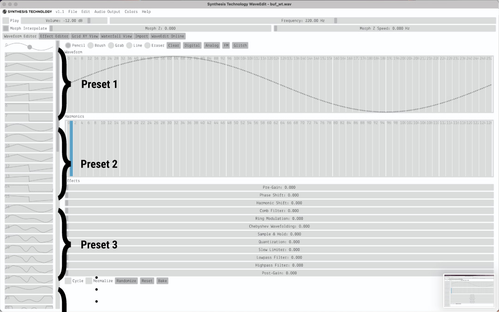

# Helical
Helicalは自己回帰型シンセシス(Autoregressive Algorithmic Synthesizer)により構成された16音ポリフォニックシンセサイザーです。  
自己回帰型シンセシスにより、無限に新しいフレーズや音響を生み出し続けます。  
それぞれのオシレーターは、シーケンサー、Wavetabbleオシレーター、エンベロープジェネレーター、VCAを持っており、それらは各オシレーター毎に独立しています。  
ユーザーはパネル前面のSDカードに書き込むことで、スケール、LEDの色を専用のエディターで変更する事ができ、Wavetableも自由に変更可能です。

    

# Autoregressive Synthesis/Sequence
自己回帰型シンセシスはオリジナルの手法で、次のパラメーターを決定する為に、過去の状態を参照するアルゴリズムを持っています。
Helicalでは、それぞれのオシレーターの過去のピッチ(音高)が次の音の長さ(音価)を決定し、過去の音価が次の音高に影響を与えています。過去から螺旋状(helical)に影響を受けることにより、完全なランダムとは異なる、自然な音響を生成します。

  

新しい音高と音価はそれぞれのオシレーターのエンベロープが最後にたどり着いた瞬間に決定されます。

音価と音高の計算されるイメージは上記の様になります。

Helicalは既存の音楽のリズムの概念(BPMから音価を決定する)ではない、新しいリズムを探求することを目的にデザインされています。  
(後述のPolyノブのCVに外部クロックを接続することにより、外部クロックとの同期もできます。)

# Diagrams
  

# Controls and Outputs

    

### Arc/Orbit
* Helicalの出力は8オシレーターユニット毎にArcアウトプットとOrbitアウトプットにルーティングされています。

Orbitアウトに何も接続されていない場合はMonoモードとなり、Arcアウトプットに全てのオシレーターユニットがルーティングされます。
### Poly 
* 同時発音数を0から8 (monoモードの場合は0から16) で設定します。  

つまみの位置がCCW(最も左)にしても、それぞれのオシレーターのエンベロープが終わりに到達するまで無音にはなりません。  
全てのオシレーターユニットは無音状態では完全に止まっており、Polyノブを上げていくことで、それぞれのオシレーターは待機状態から動作を始めます。つまり、待機状態ではエンベロープのループは停止しており、動作状態になることで初めてエンベロープが開始します。  
この特性を利用して、Polyノブを0にし、CVinにClockを接続する事で、外部のクロックと同期が可能になります。この場合HelicityノブはClockDividerの様な機能を持ちます。

### Root
* ルート音を設定します。1-5vのレンジ外ではV/OCTのトラッキングが不安定になる場合があります。
### Scale
* 使用するスケールとWavetableを設定します。スケールの変更はノブを回す事で、Wavetableの変更はノブを押しこみながら回す事で変更が可能です。  
  
reloAd(左下のリロードボタン)を押しながらScaleノブを押し込み、回すことで、デフォルトの音量を設定する事ができます。
relOad(右下のリロードボタン)を押しながらScaleノブを押し込み、回すことで、FineTuneを設定する事ができます。(2022年7月13日時点では未実装)
これらの設定は次回起動じも引き継がれます。(2022年7月13日時点では未実装)

### Glide
* それぞれのオシレーターユニットが、次の音高に変更されるさいのポルタメントを設定します。

これらの設定はScaleやRootの変更、reloadボタンなど全てのピッチの変更に適用されます。

### Spread
* 音価から音高を計算する際の音高の幅を設定します。

CCWでRootで設定された音のみ、CWでRootからG9までの幅が適応されます。

### Wave
* プリセットで選択されたWavetable内をモーフィングさせます。
  
全てのwavetable間は保管されているので、スムースにwavetable間を移動する事ができます。

### Helicity
* 音高から音価を計算する際の倍率を決定します。

音価は √音高*Helicity の計算で決定され、Helicityの値は0.002から300倍の値をとります。

### Env
* エンベロープのアタックとディケイの割合を設定します。

エンベロープの割合の変更はそれぞれのエンベロープが最後に到達した後に適応されます。
これを利用して、非常に早いアタックの音、ゆっくりとしたアタック、逆再生の様な音を同時に再生させる事ができます。
ノブの左右の15%ではエンベロープのカーブがリニアからログに変更されます。

### re(L)oad / (R)eload
* Arc/Orbit出力のそれぞれのユニットのパラメーターを強制的に再計算します。  

5Vのゲート外部信号でトリガーする事ができます。

### Lock

* エンベロープが最後間で到達しても、音高と音価の計算を行わないスイッチです。
  
Gateを接続することで、GateがHIGHの時はロックされます。

# Wavetable Edit
Synthesis Technologyの<a href="https://synthtech.com/waveedit/">Wave Edit</a>を使用して、オリジナルのwavetableのプリセットを作る事ができます。

  
上図の様に、上から8個のwavetableごとにHelicalの一つのプリセットになります。
書き出したwavファイルをbuf_wt.wavという名前にリネームして、SDカードに上書きしてください。

Wave Editのより詳細な説明や使い方については<a href="https://synthtech.com/waveedit/">SynthsisTechnology</a>のページを参照してください。

もし他のソフトウェアやプログラムを使用する場合は、256sample、64テーブルの計16384sampleのwavファイルを書き出して、buf_wt.wavとリネームし、SDカードに上書きしてください。

# Scale Edit
ScaleEditのページを参照してください。

# Update firmware

Helicalは公式のファームウェア以外の対応は行いません。  
非公式のDaisyのファームウェアを書き込んだことによって起きた故障は、保証の対象外となります。

HelicalのGitHubのページからファームウェア（binファイル）をダウンロードしてください。  
<a href = "https://electro-smith.github.io/Programmer/">Daisy Web Programmer</a> のページに移動し、記載されている手順に従ってファームウェアをアップロードしてください。  
DaisySeedからUSBケーブルを抜いた後、ユーロラックケースの電源を入れて、ファームウェアのアップデートが正常に行われているか確認してください。  
Helicalの背面にあるシリアル番号が6から55の場合、出荷時のファームウェアはv1.1です。

# Specification
Width : 16HP  
Max Depth: 40mm  
Maximum current draw:
* 220mA @12V
* 12mA @-12V
  
Audio codec: 48kHz/24bit  
Control rate: audio-rate for the Helicity knob, 1kHz for the another CV inputs.  
CV input range: +/- 5V (depends on the knob position)

# Roadmap
* エクスパンダーの開発(SVFフィルターがそれぞれのオシレーターユニットに搭載されます。)
* ScaleEditor上でMicroTuning(微分音)のScaleを作れる様にします。

# Acknowledgment
以下の人々の助けがなければHelicalは完成しませんでした。  
心からの感謝を捧げます。  
* <a href = "https://hananosuke.jp/">Hananosuke Takimoto</a>
* Tanipoyo
* <a href = "https://www.bofo.jp/">Tajima Yoshimi(Cloud Design on the panel)</a>